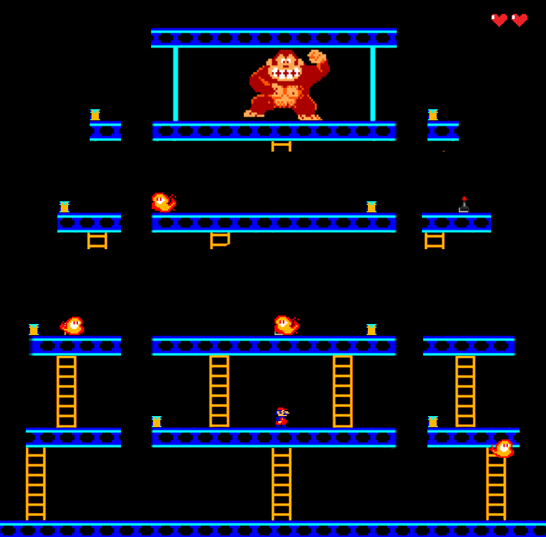

# Donkey Kong Wollok Edition

## Equipo de desarrollo

-Negreti Carballo Nahuel

-Rosales Tomás

-Santana Lucas

-Viltez Hernán

## Reglas de juego/instrucciones

En Donkey Kong Wollok Edition tendremos dos objetivos:

-En el primer escenario tendremos que salvar a la princesa de las garras de Donkey Kong. Para ello, nos tendremos que enfrentar tanto a los barriles que nos tira Kong, como a su pequeño esbirro de fuego que nos acecha si no avanzamos rápido. El nivel acaba una vez salvada la princesa.

-En el segundo escenario tendremos que enfrentarnos a Donkey Kong cara a cara. Para ello, tendremos que evitar o enfrentar a una legion de esbirros de fuego y a la condición que nos impone este segundo escenario: encontrar las palancas para ir liberando las escaleras. El nivel acaba una vez recogidos los 8 gatos mecánicos repartidos en este segundo escenario.

## Controles

# Capturas

## Primer Escenario

## Segundo Escenario

## Partida Perdida

## Partida Ganada

